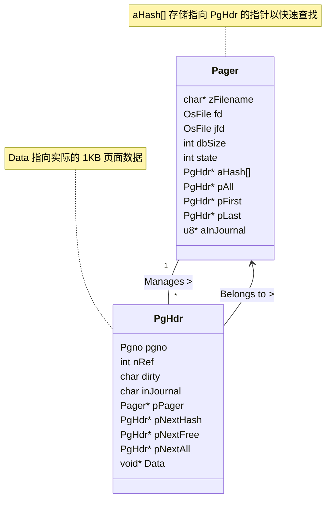

# Pager 模块分析

本文档对 Simple SQLite 项目中的 `pager` 模块（主要涉及 `core/pager.c` 和 `core/pager.h`）进行详细分析。

## 1. 模块概述

Pager（分页器）是 SQLite 的核心组件之一，负责管理数据库文件的读写操作。它实现了以下关键功能：
- **页面缓存（Page Cache）**：将磁盘上的数据页加载到内存中，减少磁盘 I/O。
- **原子提交（Atomic Commit）**：通过日志文件（Journal File）确保事务的原子性，即事务要么全部成功，要么全部失败。
- **回滚（Rollback）**：利用日志文件在事务失败或用户主动取消时恢复数据。
- **并发控制**：通过文件锁防止多个进程同时写入或读写冲突。

## 2. 核心结构体分析

Pager 模块的核心在于两个结构体：`Pager` 和 `PgHdr`。

### 2.1 `Pager` 结构体

`Pager` 结构体代表一个打开的数据库文件的页面缓存管理器。每个打开的数据库连接对应一个 `Pager` 实例。

**主要成员：**

*   **文件管理**:
    *   `zFilename`, `zJournal`: 数据库和日志文件的路径。
    *   `fd`, `jfd`, `cpfd`: 数据库、日志和检查点日志的文件描述符。
    *   `tempFile`: 标记是否为临时文件。
*   **缓存状态**:
    *   `dbSize`, `origDbSize`: 数据库当前页数和事务开始前的页数。
    *   `state`: 当前状态（`SQLITE_UNLOCK`, `SQLITE_READLOCK`, `SQLITE_WRITELOCK`）。
    *   `aHash[N_PG_HASH]`: 用于快速查找内存页面的哈希表。
    *   `pAll`: 指向所有内存页面的链表头。
    *   `pFirst`, `pLast`: 指向空闲页面（`nRef==0`）链表的头和尾（用于 LRU 替换算法）。
*   **事务控制**:
    *   `journalOpen`: 日志文件是否打开。
    *   `aInJournal`: 位图，标记哪些页面已写入日志。
    *   `dirtyFile`: 标记数据库文件是否被修改。

### 2.2 `PgHdr` 结构体

`PgHdr`（Page Header）是内存中每个数据页的头部信息。它包裹了实际的页面数据，用于管理页面的状态和链表关系。

**主要成员：**

*   **基本信息**:
    *   `pgno`: 页码（从 1 开始）。
    *   `pPager`: 指向所属的 `Pager` 实例。
    *   `nRef`: 引用计数。当 `nRef > 0` 时，页面被“钉”在内存中，不能被回收。
*   **链表指针**:
    *   `pNextHash`, `pPrevHash`: 哈希冲突链表，用于在 `Pager.aHash` 中解决冲突。
    *   `pNextFree`, `pPrevFree`: 空闲链表，连接所有 `nRef==0` 的页面。
    *   `pNextAll`, `pPrevAll`: 所有页面链表，连接 `Pager` 管理的所有页面。
*   **状态标志**:
    *   `dirty`: 标记页面是否被修改（脏页）。
    *   `inJournal`: 标记页面原始数据是否已备份到日志文件中。

### 2.3 结构体关系图

## 3. 架构与工作流程

Pager 的工作流程主要围绕状态机和页面生命周期展开。

### 3.1 状态机

Pager 有三种主要状态：

1.  **SQLITE_UNLOCK (0)**: 初始状态，无读写操作，无锁。
2.  **SQLITE_READLOCK (1)**: 正在读取。持有共享锁（Shared Lock）。允许多个读者。
3.  **SQLITE_WRITELOCK (2)**: 正在写入。持有排他锁（Exclusive Lock）。只允许一个写者。

**状态流转：**
*   `sqlitepager_get()`: UNLOCK -> READLOCK
*   `sqlitepager_write()`: READLOCK -> WRITELOCK (需要先读取页面)
*   `sqlitepager_commit()` / `sqlitepager_rollback()`: WRITELOCK -> READLOCK
*   `sqlitepager_unref()` (当所有页面释放时): READLOCK -> UNLOCK

### 3.2 页面获取与缓存 (sqlitepager_get)

当请求一个页面时：
1.  **查找**: 计算页码哈希，在 `aHash` 中查找是否已在内存。
2.  **命中**: 如果找到，增加 `nRef`，从空闲链表（如果有）中移除，返回页面。
3.  **未命中**:
    *   如果缓存已满（`nPage >= mxPage`），从空闲链表（`pFirst`）中回收一个页面（LRU 策略）。
    *   如果无法回收（所有页面都在使用），分配新内存。
    *   从磁盘读取页面数据。
    *   初始化 `PgHdr`，插入哈希表和所有页面链表。

### 3.3 写入与日志 (sqlitepager_write)

在修改页面之前，必须调用 `sqlitepager_write`：
1.  **状态检查**: 确保处于 `WRITELOCK` 状态（或升级锁）。
2.  **日志记录**:
    *   检查 `inJournal` 标志。
    *   如果为 false，说明是事务中首次修改该页。
    *   将页面**修改前**的内容写入日志文件（Journal File）。
    *   设置 `inJournal = true`，并在 `Pager.aInJournal` 位图中标记。
3.  **标记脏页**: 设置 `PgHdr.dirty = true`。

### 3.4 提交 (sqlitepager_commit)

1.  将所有脏页（`dirty == true`）写入数据库文件。
2.  同步数据库文件（fsync），确保数据落盘。
3.  删除或截断日志文件，标志事务结束。
4.  降级锁状态。

### 3.5 回滚 (sqlitepager_rollback)

1.  读取日志文件。
2.  将日志中记录的原始页面数据覆盖回数据库文件和内存缓存。
3.  恢复 `dbSize` 到 `origDbSize`。
4.  删除日志文件。

## 4. 关键条件与场景分析

### 4.1 缓存溢出 (Cache Overflow)
*   **条件**: `nPage >= mxPage` 且请求新页面。
*   **处理**: 尝试淘汰 `nRef == 0` 的页面。`Pager` 维护了一个空闲链表（`pFirst`, `pLast`），通常使用 LRU（最近最少使用）近似策略，新释放的页面添加到链表尾部，回收时从头部取。

### 4.2 事务中的多次修改
*   **场景**: 同一个页面在一次事务中被多次 `sqlitepager_write`。
*   **处理**: `inJournal` 标志确保只有第一次修改前的数据会被写入日志。后续修改直接在内存中进行，无需再次写日志。

### 4.3 异常终止
*   **场景**: 写入过程中断电或崩溃。
*   **恢复**: 下次打开数据库时，Pager 发现存在热日志（Hot Journal），会自动执行回滚操作，利用日志恢复数据库到一致状态。

## 5. 总结

Pager 模块通过精巧的 `PgHdr` 和 `Pager` 结构设计，结合日志机制和锁机制，完美地解决了数据库系统的 ACID 特性中的原子性（Atomicity）、隔离性（Isolation）和持久性（Durability）。它是 SQLite 存储引擎的基石。
